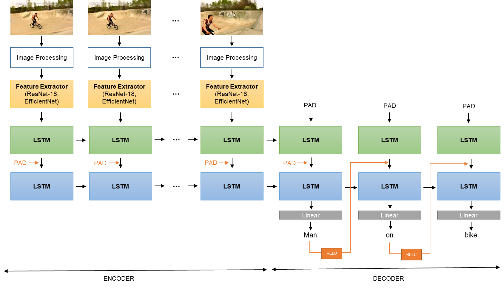

# vid-caption-generation

## Introduction
In this project, our goal is to produce a deep learning model that, given a sequence of frames from a video, generates three-word captions in the form object1-relationship-object2. Given that the three words come from a predefined list of 35 objects and 82 relationships, this is a three-way classification problem.

## Model used

We use a sequence to sequence model for caption generation. 

The temporal nature of the input data makes RNN an excellent choice for modelling, since the prediction of the three words are not independent of each other, but are likely to have some sort of temporal relationship. 

LSTM was eventually chosen because it is much abler to capture long-term dependencies. In terms of structuring the layers, we took reference from Venugopalan et al. (2015) as well as the model suggested by the teaching assistant. We also experimented with GRU, which we found to be more time efficient due its relatively simpler structure, but displayed inferior performance relative to LSTM.

For description information, refer to report.

*__Model architecture__. There are 4 LSTM cells in total: top encoder, bottom encoder, top decoder and bottom decoder. The object1 and relationship predictions are transformed via a relu hidden layer before being fed back into the bottom decoder.*

## Results

Refer to report.
